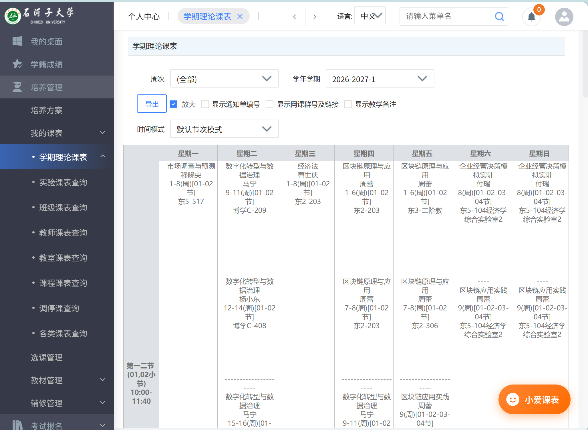

# 石河子大学课表一键导入小爱课程表

> 让石河子大学的同学，一键把教务系统课表导入小爱课程表，无需 Root、无需电脑中转。

---

## 📖 项目简介

小爱课程表官方已于 2024 年停止维护，导致"教务系统导入"功能失效。本项目通过**油猴脚本 + Deep Link** 的方式，让石河子大学的同学重新拥有"一键导入"体验。

**核心特性：**
- ✅ 无需 Root、无需电脑配合
- ✅ 支持电脑端（预览 / 导出 JSON / 导出 ICS / 一键导入）
- ✅ 支持移动端（Kiwi Browser 、edge等）
- ✅ 自动识别开学日期、自动适应学期切换
- ✅ 数据自动上传小米云端，多设备同步

## ✨ 效果展示

| 电脑端 | 移动端 |
|--------|--------|
|  |  |

| 课表预览 |
|----------|
|  |

## 🚀 安装

### 前置条件

- **电脑端**：Chrome / Edge + [Tampermonkey](https://www.tampermonkey.net/)
- **移动端**：[Kiwi Browser](https://play.google.com/store/apps/details?id=com.kiwibrowser.browser) + Tampermonkey 扩展

### 安装脚本

**方式一：直接安装（推荐）**

点击 [这里](https://github.com/your-username/shzu-xiaoai-schedule/raw/main/shzu-xiaoai-schedule.user.js) 安装脚本，Tampermonkey 会自动弹出安装页面。

**方式二：手动安装**

1. 打开 Tampermonkey 面板 → 新建脚本
2. 复制 [`shzu-xiaoai-schedule.user.js`](./shzu-xiaoai-schedule.user.js) 全文
3. 粘贴 → `Ctrl + S` 保存

## 📋 使用教程

### 电脑端

1. 浏览器打开 [石河子大学教务系统](https://jwgl.shzu.edu.cn/jsxsd/) 并登录
2. 进入**学生个人课表** 页面（培养管理→我的课表→学期理论课表）
3. 右下角会出现橙色“**小爱课表**”按钮，点击展开面板：
   - **👁 预览课表** — 表格形式查看解析结果
   - **📄 导出 JSON** — 导出原始数据
   - **📅 导出 ICS** — 导出日历文件（可导入系统日历）
   - **🚀 一键导入** — 唤起小爱课程表

### 移动端

1. Kiwi Browser 打开教务系统并登录（edge浏览器同理）
2. 进入"学生个人课表"页面
3. 右下角出现圆形图标 → 点击展开 → 再次点击"一键导入"
4. 系统唤起小爱课程表 → 确认导入 → 完成

### 首次使用

- 脚本会自动识别当前学期和当前周数，推算开学日期
- 如果识别失败，会弹窗让你手动输入"现在是第几周"
- 结果会缓存在浏览器本地，之后无需重复输入

## ❓ 常见问题

<b>Q: 为什么按钮出现两个？</b>

可能是 Tampermonkey 中重复安装了脚本。请打开 Tampermonkey 管理面板，**删除所有相关脚本**，然后重新安装一次。

<b>Q: 提示"未找到课表"怎么办？</b>

请确认已经进入**"学生个人课表"**页面（有"导出"按钮的那个），而不是教务系统首页。

<b>Q: 手机端点击按钮无反应？</b>

可能是 Kiwi Browser 拦截了 `voiceassist://` 跳转。请在 Kiwi 的设置中允许跳转到其他 App。

<b>Q: 导入后课表显示错乱？</b>

请在电脑端点"预览课表"，检查：
- 开学日期是否正确
- 周次是否与教务系统一致
- 节次时间是否符合学校安排

如果不对，可在电脑端执行 `window.shzuSetDevice('auto')` 重置，或清除缓存重新导入。

<b>Q: 换学期了怎么办？</b>

脚本会自动检测学期切换（通过 `xnxq01id`）。如果发现学期 ID 变化，会自动清空旧缓存，重新识别开学日期。

## 🧠 技术原理
教务系统 HTML
↓ 解析（DOM 遍历）
课程 JSON 数组
↓ 构造 presetData
小爱课程表协议数据
↓ 拼接 Deep Link
voiceassist://aiweb/?...&presetData=...
↓ 唤起
小爱课程表 App
↓ 走官方导入流程
本地保存 + 云端同步

**为什么不用"直接写 localStorage"的方式？**

小爱课程表 App 启动时会从云端拉取权威数据覆盖本地，所以直接写 localStorage 会被覆盖。而 Deep Link 是 App 官方支持的入口，数据交给 App 自己处理，不会被覆盖。

## 🙏 致谢

- [XiaoAISchedule-CDU](https://github.com/Yaoser-x/XiaoAISchedule-CDU) — 提供了 `voiceassist://` Deep Link 的思路
- 小爱课程表开发团队 — 曾经做出的优秀产品

## 📄 License

[MIT](LICENSE)

## ⚠️ 免责声明

本项目仅供学习交流使用，与小米公司、石河子大学教务处无关。使用本工具产生的任何后果由使用者自行承担。